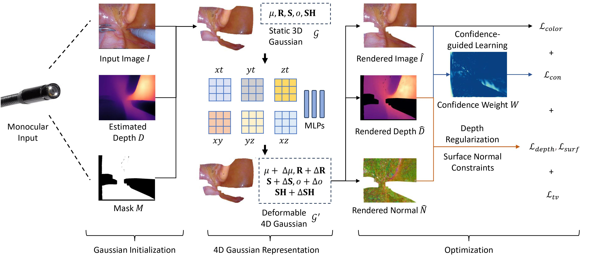

<!-- PROJECT LOGO -->

<p align="center">

  <h1 align="center">Endo-4DGS: Endoscopic Monocular Scene Reconstruction with 4D Gaussian Splatting</h1>
  <div align="center"></div>
</p>
<p align="center">
    
  </a>
</p>

## TODO
- [x] EndoNeRF
- [ ] StereoMIS
- [ ] Pretrained checkpoints


## Environments

We build the Python environment using [Anaconda](https://www.anaconda.com/download/):
```shell
git clone https://github.com/lastbasket/Endo-4DGS.git
cd Endo-4DGS
git submodule update --init --recursive
conda create -n ED4DGS python=3.7 
conda activate ED4DGS

pip install -r requirements.txt
pip install -e submodules/depth-diff-gaussian-rasterization
pip install -e submodules/simple-knn
pip install torch==2.0.0 torchvision==0.15.1 torchaudio==2.0.1 --index-url https://download.pytorch.org/whl/cu118
```


## Datasets
We used two datasets for training and evaluation.

### EndoNeRF

We used EndoNeRF dataset provided by [Yuehao Wang](https://docs.google.com/forms/d/e/1FAIpQLSfM0ukpixJkZzlK1G3QSA7CMCoOJMFFdHm5ltCV1K6GNVb3nQ/viewform).

### StereoMIS
We used StereoMIS dataset from [Michel Hayoz](https://zenodo.org/records/7727692)

The data structure is as follows:

```
./data
├── endonerf
│    ├── cutting_tissues_twice
│    │    └── ...
│    ├── pulling_soft_tissues
│    │    └── ...
│    └── ...
└── stereomis
    └── ...
```

### Preparing the Pretrained Depths from Depth-Anything
Download [depth_anything_vits14.onnx](https://github.com/fabio-sim/Depth-Anything-ONNX/releases) and place in:
./submodules/depth_anything/weights/depth_anything_vits14.onnx
```bash
sh prepare_depth.sh
```
## Training


```bash
sh train.sh
```
More configurations can be found in arguments/$DATASET.py

## Evaluation

```bash
# Render the testing result
sh render.sh
# Evaluation
sh eval.sh
```


## Acknowledgement

Thanks the authors for their works: [StereoMIS](https://arxiv.org/abs/2304.08023v1), [diff-gaussian-rasterization-depth](https://github.com/leo-frank/diff-gaussian-rasterization-depth), [EndoNeRF](https://github.com/med-air/EndoNeRF), [4DGaussians](https://github.com/hustvl/4DGaussians), [Depth-Anything-ONNX](https://github.com/fabio-sim/Depth-Anything-ONNX).
